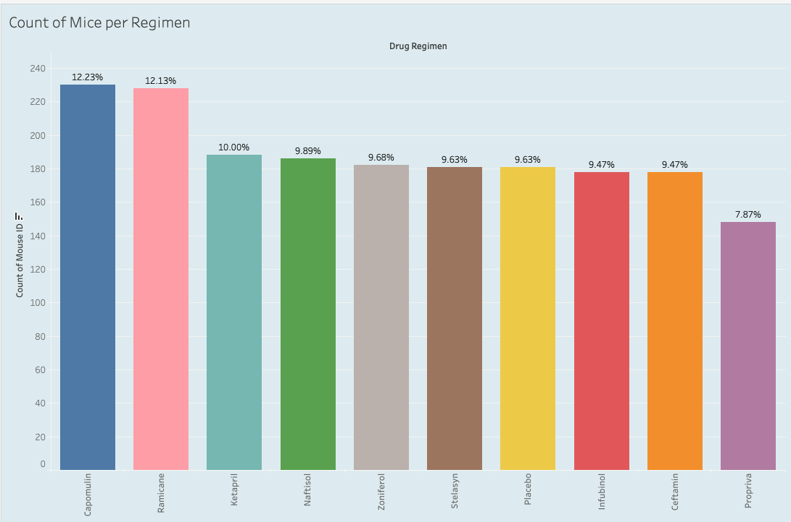

# Pharmaceutical Regimen Analysis

### Visit this Project's Repository Here: [najtompkins/pharmaceutical_regimen_analysis](https://github.com/najtompkins/pharmaceutical_regimen_analysis)
#### Interact with the Tableau Public Story for this Analysis Here: [Tableau Public Story](https://public.tableau.com/app/profile/nathan.andrew.tompkins/viz/regimen_analysis/StudyAnalysis?publish=yes)
#### Download the Tableau Public workbook: [here](regimen_analysis.twbx)

<!-- **By: Nathan-Andrew Tompkins** -->
## Project Overview
  
The purpose of this analysis is to prove proficiency in Pandas and Tableau Public by cleaning and joining [two .csv files](data),  explore the [combined data](data/cleaned_data/cleaned_data.csv), and handle the new dataset which contains treatment records for nearly 250 mice. Data cleaning was performed using Python in [this](matplotlib_pharmaceuticals_analysis.ipynb) .ipynb notebook and tools such as the **Matplotlib and Pandas** Python modules and Salesforce's **Tableau Public** were utilized for visualization of the study data.

*Note:* 
*This analysis was performed as part of the 2023 UCF Data Analytics and Visualization Bootcamp. The two starting datasets [Mouse_metadata.csv](data/Mouse_metadata.csv) and [Study_results.csv](data/Study_results.csv) were found to contain anomolies that proved them as generated data for the purpose of analysis instead of true data. While the data generator is cited (mockaroo.com) in the documentation of the assignment, I was unaware of this at the time of analysis. My discovery of anomalies in the data are detailed below in the **Generated Data Analysis** header. The rest of the analysis was performed as if this data were true.*

## Study Overview
- **Number of drugs** considered in this analysis: **9 + Placebo**
- **Drug names**: *Capomulin, Ketapril, Naftisol, Infubinol, Stelasyn, Ramicane, Zoniferol, Propriva, Ceftamin* + *Placebo*
- **Total number of records before cleaning:** 1893
- **Total number of records after cleaning:** 1880
- **Initial mice recorded:** 249
- **Mice analyzed once data was cleaned:** 248
- **Most observed drugs:** Capomulin (12.2% of records), Ramicane (12.1% of records)
- **Mouse gender distribution (full study):** Male: 51%, Female: 49%
- **Avg. Weight/Tumor Volume Correlation Coefficient:** 0.84

## Observations
1. An analysis of the final tumor volumes reveals the overall effects of the study on the treated mice. Namely: the **Capomulin** and **Ramicane** regimens recorded the lowest results across the entire study, having roughly equal effectiveness on lowering tumor volume by the end of the trial (timepoint 45). *No other drug regimen indicated a significant reduction or reversal of tumor volume than these two.*   (*For information regarding **initial tumor-volume** analysis, see the Generated Data Analysis header below*)  
  

2. Despite the gender distribution for the full study being roughly equal, the individual regimens varied greatly in this. *The top-performing drugs (Capomulin and Ramicane) do not seem to be affected by this variance, as the gender distributions were 23.3% higher in female and 108.1% higher in male, respectively, while revealing the same effectiveness noted above.*   
  
  

3. It should be noted that the studies comprised of the most mice resulted in the most successful regimen, as these **collectively** contained 18.5% *more* mice than the next two regimens by count. *The effectiveness of the Capomulin and Ramicane regimens against the other 8, when found to contain a greater percentage of mice, could indicate further study.*   
  

4. A weight/tumor-size regression analysis proves that by the end of this study these two variables are highly correlated for both the Capomulin and Ramicane Regimen. The Correlation Coefficient for these variables are calculated as 0.84, and 0.81 respectively. *A high-positive correlation-coefficient means that as of the end-point of this study: as weight increases, tumor volume will also increase.*
  
  

## Summary
* The two regimen, Ramicane and Capomulin, show the most promise in treating tumors in mice. Despite the gender distributions for these two studies varying greatly, as well as the count distribution variance, they both achieved similar results, which is a significant reduction in tumor size.

## Generated Data Analysis
While performing this analysis I discovered anomalies in the data that indicate the initial CSV files are generated for the use of analysis, not true data. Below are proofs for impossible tumor volume consistency, poor measurment practices, and non-varying values in measurements.
1. Proof #1: All Tumor Weights begin at 45 cubic milimeters.  
Every mouse in these datasets indicate a starting tumor-volume as 45 cubic milimeters. There is no study where this would be true UNLESS each mouse was selected based on their tumor size, and this is not indicated by the recording processes of the study.  

2. Proof #2: Imprecise and Un-Varying Weight Measurements:   
In a pharmaceutical study such as this the measurement of weight would include a higher precision than what is revealed in the data. **These values, recorded in grams, should include a more precise decimal value** if mice (a particualarly small animal where weight variances are of much greater importance) are to be studied.  
  
Even more telling: the lack of variance in *any* mouse's recorded weight is why this is cause for alarm. The number of unique weight records per mouse below should be higher than 1, which is not the case. It is impossible that not one of the mice gained or lost weight during the study.  

3. Proof #3: Imprecise and Un-Varying Age Measurements:   
Without repeating the above: the lifespan of a mouse is short and thus age should be recorded in increments of greater precision than "months".  
  
While this is not an imemdidate indicator of generated data, the lack of variance in *any* mouse's recorded age is why this is cause for alarm. The number of unique weight records per mouse below should be higher than 1, which is not the case. It is highly unlikly that not a single mouse aged to any measureable degree during the study.  
  
